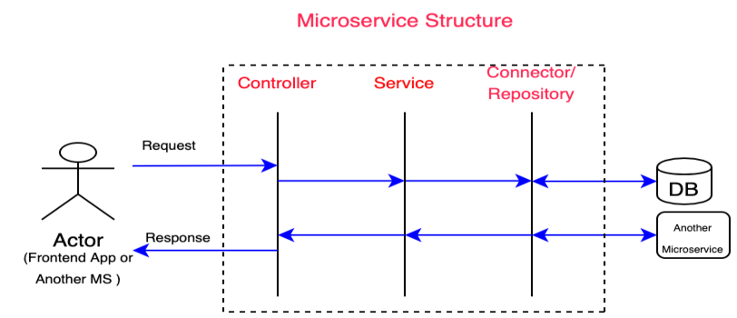
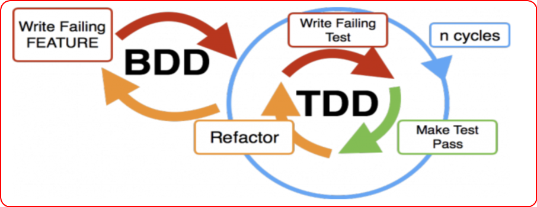
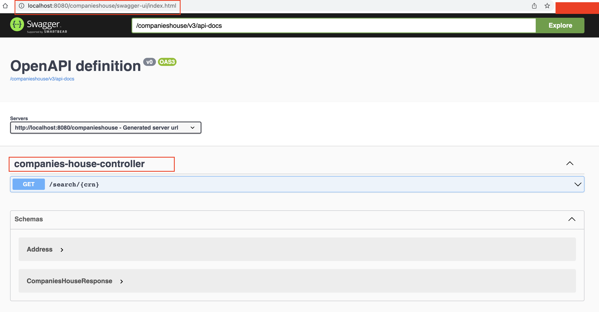
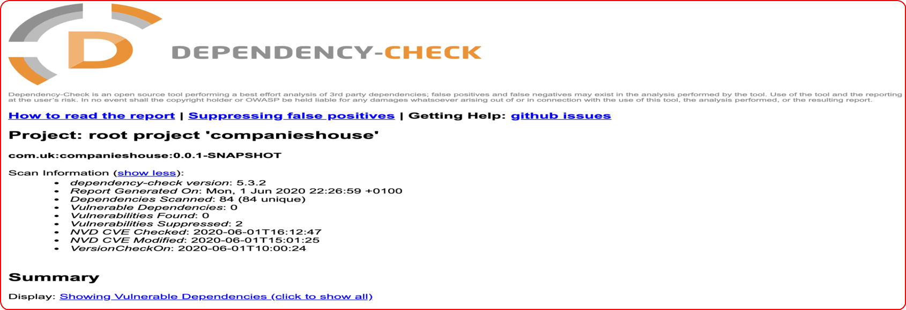

# Spring Boot Micro Service Template

### Table of Content

---

- [Introduction](#introduction)
- [Prerequisites](#prerequisites)
- [Installation and Getting Started](#installation-and-Getting-Started)
- [Microservice Structure](#microservice-structure)
- [Development Practice](#development-practice)
- [Integrations](#integrations)
  - [1. Testing](#1-testing)
    - [1.1 Unit Test](#11-unit-test)
    - [1.2 Cucumber End to End Test](#12-cucumber-end-to-end-test)
    - [1.3 Mutation Testing](#13-mutation-testing)
  - [2. Development Accelerators](#2-development-accelerators)
    - [2.1 Mapstruct](#21-mapstruct)
    - [2.2 Lombok](#22-lombok)
    - [2.3 WireMock](#23-wiremock)
  - [3. Code Analysis and Quality](#3-code-analysis-and-quality)
    - [3.1 Checkstyle](#31-checkstyle)
    - [3.2 Jacoco](#32-jacoco)
  - [4. Swagger API Documentation](#4-swagger-api-documentation)
  - [5. DevSecOps](#5-devsecops)
    - [5.1 OWASP Dependency Vulnerability Check](#51-owasp-dependency-vulnerability-check)
    - [5.2 Trivy for Docker Image Vulnerability Check](#52-trivy-for-docker-image-vulnerability-check)
  - [6. Continuous Integration, Delivery and Deployment](#6-continuous-integration-delivery-and-deployment)
    - [6.1 Docker Containerization](#61-docker-containerization)
    - [6.2 CI and CD Pipeline Tools](#62-ci-and-cd-pipeline-tools)
      - [CircleCI](#circleci)
      - [Jenkins](#jenkins)
      - [Google Cloud Build](#google-cloud-build)
  - [7. Platforms](#7-platforms)
    - [7.1 Kubernetes](#71-kubernetes)
    - [7.2 Google Cloud Run](#72-google-cloud-run)
    - [7.3 Cloud Foundry](#73-cloud-foundry)
- [What to expect Next!](#what-to-expect-next)
- [Versioning](#versioning)
- [Author](#author)
- [Contributors](#contributors)
- [License](#license)
- [Acknowledgments](#acknowledgments)

---

### Introduction

This project is intended to bring arguably best practices and integrations available for Spring Boot based Microservice
in a single repository.

Developers can use this repository as a template to build there own Microservice by adding or removing dependencies as
per requirement.

In the below section I will try to explain each integration we have made and how to use.

At the moment the microservice exposes a GET API and expects the company reference as path parameter then makes a call
to the Companies House API hence returning Company Details.

### Prerequisites

1. [ Installing and Getting Started ](#installation)
2. [ Microservice Structure ](#MSStructure)

- You must have [Java](https://www.oracle.com/technetwork/java/javaee/documentation/ee8-install-guide-3894351.html)
  installed (min version 8).
- If you wish to run the application against the actual Companies House
  API. You will need to [create a free account](https://developer.companieshouse.gov.uk/developer/signin)
  and replace the apiKey in the application.yml.

### Installation and Getting Started

Let us get started by Cloning or Downloading repository in your local
workstation.

Once cloned/downloaded import the project in your favourite IDE (IntelliJ, Eclipse etc).

We are using [Gradle Wrapper](https://docs.gradle.org/current/userguide/gradle_wrapper.html) for dependency management
so that you do not need to explicitly configure Gradle or Maven.

Execute below gradlew command to download all the dependencies specified in the gradle.build.

```bash
./gradlew clean build
```

<a propertyName = "MSStructure"></a>

### Microservice Structure

We are following Classic Microservice "Separation of Concerns" pattern having Controller <--> Service <--> Connector layers.

The three different takes the responsibilities as below:

- Controller: Controller layer allows access and handles requests coming from the client.<br/>
  Then invoke a business class to process business-related tasks and then finally respond.<br/>
  Additionally Controller may take responsibility of validating the incoming request Payload thus ensuring that any invalid or malicious data do not pass this layer.

- Service: The business logic is implemented within this layer, thus keeping the logic separate and secure from the controller layer.
  This layer may further call a Connector or Repository/DAO layer to get the Data to process and act accordingly.

- Connector/Repository: The only responsibility of this layer is to fetch data which is required by the Service layer to perform the business logic to serve the request.<br/>
  When our Microservice makes a call to another Service we would like to name it as Connector (as in our case) layer whereas when interacting with a DB commonly it's known as Repository.

  

### Development Practice

At the core of the Cloud Native Practices in Software Engineering lies the Behavior Driven Development(BDD) and
Test-Driven Development (TDD).<br/>
While developing the code I followed BDD first approach where I wrote a failing feature/acceptance criteria thus
driving our development through behavior and then followed by Test Driven Development.<br/>
A feature is not considered as developed until all the Uni Tests (TDD) and feature (BDD) passes.



## Integrations

### 1. Testing

#### 1.1 Unit Test

We are using JUnit 5 for running our unit test cases.

```
./gradlew test
```

Once executed a report as below will be generated at local path

```
build/reports/tests/test/index.html
```


#### 1.2 Cucumber End to End Test

We are using one of the most famous BDD implementation i.e., Cucumber.

Open Class `CucumberTest` in package `com.uk.companieshouse.e2e` and execute CucumberTest from the class.

Once the test execution completes you can see the Cucumber Test Report at :

```
../build/reports/cucumber/index.html
```

#### 1.3 Mutation Testing

Pitest is used for performing mutation testing.
To execute the mutation test run :

```bash
./gradlew pitest
```

once the test execution completes report should be accessible at:

```
../build/reports/pitest/[TIMESTAMP]/index.html
```


### 2. Development Accelerators

#### [2.1 Mapstruct](https://mapstruct.org/)

An excellent\* library for converting VO to DAO objects and vice versa.

#### [2.2 Lombok](https://projectlombok.org/)

Provides excellent annotations based support for Auto generation of methods, logging, Builders, Validation etc.
We will be using below annotations during this exercise:<br/>
@Data: Auto generates setters, getters, hashcode and toString methods<br/>
@Slf4j: Just add this annotation on top of any Spring Bean and start using the log

#### [2.3 WireMock](http://wiremock.org/)

**Updating instructions WIP**

Click [here](src/test/java/com/uk/companieshouse/e2e/WireMockService.java) to see implementation.

### 3. Code Analysis and Quality

#### 3.1 Checkstyle

Checkstyle is a static code analysis tool used in software development for checking if Java source code complies with coding rules.

Below config snippet is configured in the [build.gradle](./build.gradle) to include checkstyling.

```
plugins {
    id 'checkstyle'
}
checkstyle {
    toolVersion '7.8.1'
}
tasks.withType(Checkstyle) {
    reports {
        xml.enabled false
        html.enabled true
        html.stylesheet resources.text.fromFile('config/xls/checksyle-style.xsl')
    }
}
```

and checkstyle [config at this location](config/checkstyle).

Execute below command to perform static code analysis.

```bash
./gradlew check
```

Once successfully executed Checkstyle reports will be generated at:

```
build/reports/checkstyle/main.html
build/reports/checkstyle/test.html
```


#### [3.2 Jacoco](https://www.jacoco.org/jacoco/trunk/index.html)

Code coverage is a preliminary step to know whether our test covers all the scenarios we have developed so far.

Jacoco is a free Java code coverage library distributed under the Eclipse Public License.

Add below configuration in [build.gradle](./build.gradle) to enable Jacoco in your project.

```
plugins{
  id 'jacoco'
}
ext{
  jacocoVersion = "0.8.5"
}
// Jacoco for Code Coverage
jacoco {
    toolVersion = "${jacocoVersion}"
    reportsDir = file("$buildDir/customJacocoReportDir")
}

// Runs Jacoco tasks when build task is executed
build {
    finalizedBy jacocoTestReport
    finalizedBy jacocoTestCoverageVerification
}
// Setting custom parameters when executing jacocoTestReport task
jacocoTestReport {
    reports {
        xml.enabled false
        csv.enabled false
        html.destination file("${buildDir}/reports/jacocoHtml")
    }
}

// Setting custom parameters when executing jacocoTestCoverageVerification task for setting rules
jacocoTestCoverageVerification {
    violationRules {
        rule {
            limit {
                minimum = 1.0
            }
        }

        rule {
            enabled = false
            element = 'CLASS'
            includes = ['org.gradle.*']

            limit {
                counter = 'LINE'
                value = 'TOTALCOUNT'
                maximum = 1.0
            }
        }
    }
}
```

Execute below commands to generate and test code coverage(jacoco tasks depends on test task).

```bash
./gradlew test -Pexcludee2e=**/true*
./gradlew jacocoTestReport
./gradlew jacocoTestCoverageVerification
```

Once successfully executed a report as shown below will be generated at path

```
build/reports/jacocoHtml/index.html
```


### 4. Swagger API Documentation

We are using Swagger.
To test it locally start the application to and the Swagger UI document can be accessed by URL:

```
http://localhost:8080/companieshouse/swagger-ui.html
```


Once application is deployed in a Platform the same documentation will be accessible by below URL:

```
http://[HOST_URL]/companieshouse/swagger-ui.html
```

where "companieshouse" is the context path.

### 5. DevSecOps

  #### 5.1 OWASP Dependency Vulnerability Check

  **Updating instructions WIP**

  Add below config snippet in your [build.gradle](./build.gradle) to include dependency vulnerability checks.

  ```
  plugin {
    id "org.owasp.dependencycheck" version "5.3.2.1"
  }
  dependencyCheck {
      // the default artifact types that will be analyzed.
      analyzedTypes = ['jar']
      // CI-tools usually needs XML-reports or JUnit XML reports, but humans needs HTML.
      formats = ['HTML', 'JUNIT']
      // Specifies if the build should be failed if a CVSS score equal to or above a specified level is identified.
      failBuildOnCVSS = 7
      outputDirectory = "build/reports/dependency-vulnerabilities"
      // specify a list of known issues which contain false-positives
      suppressionFiles = ["$projectDir/config/dependencycheck/dependency-check-suppression.xml"]
      // Sets the number of hours to wait before checking for new updates from the NVD, defaults to 4.
      cveValidForHours = 24
  }
  ```

  then run below gradle task to trigger the checks

  ```
  ./gradlew dependencyCheckAnalyze
  ```

  Note: First execution may take 10 mins or so (as this task downloads a copy of the vulnerabilities db locally).

  once successfully executed the task will generate a vulnerability report at path (assuming the above path was used) as below:

  ```
  build/reports/dependency-vulnerabilities
  ```

  

  #### 5.2 Trivy for Docker Image Vulnerability Check

  **Updating instructions WIP**
  The easiest way to start using Trivy is pull docker image:

  ```
  docker pull aquasec/trivy
  ```

  and run the container run commands against the image to be checked as 

  ```
  Syntax : docker run aquasec/trivy:latest [DOCKER_HUB_REPO]/[DOCKER_IMAGE_NAME]:[TAG]
  Example: docker run aquasec/trivy:latest abhisheksr01/companieshouse:latest
  ```
  Once executed successfully it output a tabular report.

  You can use trivy in container based Pipelines as I have used in CircleCI [config.yml](.circleci/config.yml) and GCP Cloud Build [cloudbuild.yaml](./cloudbuild.yaml).

  Refer the trivy [github doc](https://github.com/aquasecurity/trivy) for further reference.

### 6. Continuous Integration, Delivery and Deployment

**Continuous Integration**: It's a software development practise where members of a team integrate their work frequently, usually each person integrates at least daily - leading to multiple integrations per day.<br/>
Each integration is verified by an automated build (including test) to detect integration errors as quickly as possible.

Continuous Integration is a key step to digital transformation.

**Continuous Delivery**: It's software engineering approach in which teams produce software in short cycles, ensuring that the software can be reliably released at any time and, when releasing the software, doing so **manually**.

**Continuous Deployment**: It means that every change goes through the pipeline and **automatically** gets put into production, resulting in many production deployments every day.<br/>
To do Continuous Deployment you must be doing Continuous Delivery.

Pictorial representation of the above two approaches:


Reference :

- https://martinfowler.com/articles/continuousIntegration.html
- https://martinfowler.com/bliki/ContinuousDelivery.html
- https://dzone.com/articles/continuous-delivery-vs-continuous-deployment-an-ov

Now let us look at the key building blocks for achieving CI/CD.

#### 6.1 Docker Containerization

#### 6.2 CI and CD Pipeline Tools

- #### [CircleCI](https://circleci.com/)

  CircleCI is a Software as a Service (SaaS) CI/CD pipeline tool chain in the DevOps world. Personally I found it quite easy to integrate with the GitHub repo and start building my CI/CD pipeline.<br/>
  CircleCI runs each job in a separate container or VM. That is, each time your job runs CircleCI spins up a container or VM to run the job in.

  At the time of writing this article CircleCI's free-tier provides 2500 free credits to run GitHub & Bit Bucket repositories based pipelines.

  It is highly recommended to go through [CircleCI's official Getting Started](https://circleci.com/docs/2.0/getting-started/#section=getting-started).

  To start using CircleCI follow below steps:

  1. [Sign UP](https://circleci.com/docs/2.0/first-steps/)
  2. Create a folder **.circle** and a pipeline config file inside it as **config.yml** (beware the extension should strictly be .yml rather than .yaml, i hope CircleCI fixes this in upcoming releases).
  3. CircleCI's basic building blocks are:

  - [Jobs](https://circleci.com/docs/2.0/jobs-steps/#jobs-overview): Where individual stages in our pipeline is executed.
  - [Steps](https://circleci.com/docs/2.0/jobs-steps/#steps-overview): A collection of executable commands which are run during a job.
  - [Workflows](https://circleci.com/blog/modernizing-federal-devops-circleci-becomes-first-continuous-integration-tool-with-fedramp-authorization/): It orchestrate the jobs as a pipeline.
  - [Executors](): Underlying technology or environment in which to run a job. Example: Docker images, Linux virtual machine (VM) image, MacOS VM image, Windows VM image
  - [Orbs](https://circleci.com/docs/2.0/jobs-steps/#orbs-overview): Reusable & Shareable packages of configs which can be imported to ease the pipeline configurable.

  4. Click [here](.circleci/config.yml) to open the CircleCI config file for this project. When this config runs for the "workflow-all-jobs" the output pipeline is shown below and deploys the app to AWS EKS Cluster.
     
  5. If you wish to use this config file in your project you must create a context "credentials" and add below Environment Variables to it with appropriate values.

     Follow [link](https://circleci.com/docs/2.0/env-vars/?utm_medium=SEM&utm_source=gnb&utm_campaign=SEM-gb-DSA-Eng-ni&utm_content=&utm_term=dynamicSearch-&gclid=EAIaIQobChMIm_2blLze6QIVQeztCh3FGwh0EAAYASAAEgITlPD_BwE#setting-an-environment-variable-in-a-context) to learn how to do it.

     ```
     AWS_ACCESS_KEY_ID
     AWS_DEFAULT_REGION
     AWS_SECRET_ACCESS_KEY
     DOCKER_USER (Your docker username)
     DOCKER_PASS (Your docker user's password)
     EKS_CLUSTER_NAME (Kubernetes cluster    name)
     DOCKER_IMAGE (Docker Image name)
     EKS_NAMESPACE (Kubernetes namespace to which the aws user has access to and you would like to deploy)
     HEALTH_ENDPOINT (Health Endpoint of your app)
     ```

  6. [Scheduled Workflows](https://circleci.com/docs/2.0/workflows/?utm_medium=SEM&utm_source=gnb&utm_campaign=SEM-gb-DSA-Eng-ni&utm_content=&utm_term=dynamicSearch-&gclid=EAIaIQobChMI4fi6icfe6QIVBbTtCh3YRwFcEAAYASAAEgJKhPD_BwE#scheduling-a-workflow):
     CircleCI supports scheduled execution of the workflow, look for **scheduled-vulnerability-check** in the [config.yml](.circleci/config.yml).<br/>
     Here I am checking for vulnerabilities within my code libs and docker images at scheduled intervals.
     <br/>What I like about this feature is we do not need to create a separate pipeline file or steps to run the jobs.

- #### [Jenkins](https://jenkins.io/)

  Jenkins is one of the most widely used CI/CD Build Tool preferred by many Organizations especially within Enterprises so one needs
  to know the basics of this Mammoth Build Tool.

  Installation Guide:

  1. Jenkins Image (`Recommended`): If you have docker installed, the easiest way to get started is by getting the
     public Jenkins image by following the
     [instructions](https://github.com/jenkinsci/docker/blob/master/README.md).

  2. Jenkins War: Follow the [instructions](https://www.blazemeter.com/blog/how-to-install-jenkins-on-the-apache-tomcat-server/)
     to install the Jenkins and run on a Web Server.

     **Updating instructions WIP**

     Click [here](jenkins/jenkinsfile) to see implementation.

- #### [Google Cloud Build](https://cloud.google.com/cloud-build/docs/)

  Cloud Build is a service that executes your builds on Google Cloud Platform infrastructure.<br/>
  Cloud Build can import source code from Google Cloud Storage, Cloud Source Repositories, GitHub, or Bitbucket,
  execute a build to your specifications, and produce artifacts such as Docker containers or Java archives.

  Cloud Build executes your build as a series of build steps, where each build step is run in a Docker container.

  We can either trigger Cloud Build through `gcloud` CLI or by declaring the steps in `cloudbuild.yaml`.

  **Updating instructions WIP**

  Click [here](./cloudbuild.yaml) to see implementation.

  #### Exercise:

  To perform this exercise you must have signed for [Google Cloud Platform account](https://cloud.google.com)
  and [gcloud SDK configured](https://cloud.google.com/sdk/docs/quickstarts).

  You can register [here](https://cloud.google.com/free) for GCP Free Tier.

  We are going to deploy our Microservice container to Cloud Run (Fully Managed through Cloud Build).

  Execute below command to use local `cloudbuild.yaml` to perform steps

  - Create a docker image & store it in Container Registry
  - Deploy the image to Cloud Run (Fully Managed)

  ```bash
  gcloud builds submit
  ```

### 7. Platforms

#### 7.1 Kubernetes

**Updating instructions WIP**

- Standard App Deployment

  Source files at :

  ```
  kubernetes/std/
  ```

  ```
   kubectl apply -f kubernetes/std/ -n [NAMESPACE]
  ```

- Helm Chart

  Source files at :

  ```
  kubernetes/helm-chart/
  ```

  ```
   kubectl apply -f kubernetes/helm-chart/ -n [NAMESPACE]
  ```

#### [7.2 Google Cloud Run](https://cloud.google.com/run/)

Cloud Run is a fully managed to compute platform that automatically scales your stateless containers.<br/>
Cloud Run is Serverless: it abstracts away all infrastructure management, so you can focus on what matters most - building great applications.<br/>
Cloud Run is available in below two flavours:

- Cloud Run Fully Managed
- Cloud Run on Anthos, which supports both Google Cloud and on‐premises environments.

#### 7.3 Cloud Foundry

     [WIP]

### Built With

- [Spring Boot](https://spring.io/projects/spring-boot) - The REST framework
  used
- [GRADLE](https://gradle.org/) - Dependency Management

### What to Expect Next!

As the world of software engineering is evolving so we do.<br/>
Listing down some of the exciting features am going to work on and update the GitHub in coming days, they are:

- Chaos Monkey
- Hystrix
- CORS (Cross-Origin)
- Concourse Pipeline
- Associated Officers - Companies House API

### Versioning

We use [SemVer](http://semver.org/) for versioning. For the versions
available, see the
[tags on this repository](https://github.com/your/project/tags).

### Author

- **Abhishek Singh Rajput** - _Initial work_ -
  [abhisheksr01](https://github.com/abhisheksr01)

### Contributors

As mentioned in the [Introduction](#introduction) through this project we would like to bring the Best Practices and Integration under one umbrella.

So you are most welcome to improve or add new features you could think of.

### License

This project is licensed under the MIT License - see the
[LICENSE.md](LICENSE.md) file for details

### Acknowledgments

- [Eugen Paraschiv](https://www.baeldung.com/) : For wonderful tutorials
